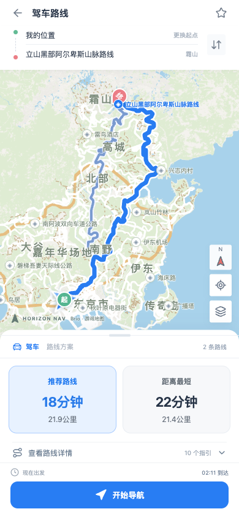
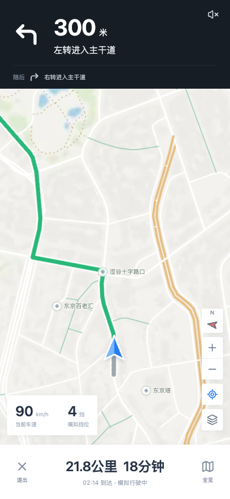

# HorizonNav

[English](README.md) | 简体中文

React + TypeScript 地图前端，Go 后端。使用 Brio 路网提供路线规划、转向提示、偏航重算与返回道路指引。后端同时提供静态文件托管、Forza UDP 遥测接收、SSE 推送和多目标 UDP 原样转发。

## 界面预览

<p>
  
  
</p>

截图使用模拟遥测。

## 直接运行打包版

解压对应平台的文件夹，修改 `config.yaml` 后运行 `HorizonNav.exe`（Windows）或 `./HorizonNav`（macOS / Linux）。浏览器访问 `http://127.0.0.1:5173`；手机访问运行程序电脑的局域网 IP 与同一 HTTP 端口。**运行包不需要 Node.js、Go、Python 或数据库。**

```text
HorizonNav-windows-amd64/
  HorizonNav.exe
  config.yaml
  dist/         # 前端文件、底图与地图显示数据
  data/         # 外置算路数据 graph.json / roads.json
  使用说明.md
```

程序默认读取二进制旁的配置，不受当前工作目录影响。也可运行 `HorizonNav -config /path/to/config.yaml`。配置中的相对路径均相对于该配置文件的目录；修改配置和路网后重启生效。路网数据没有嵌入二进制，替换数据无需重新编译；更新整张地图时应同时更新对应的 `dist/` 地图显示数据。

## 配置

```yaml
http:
  host: "0.0.0.0"      # 本机专用可改为 127.0.0.1
  port: 5173
frontend:
  path: "./dist"
data:
  path: "./data"
telemetry:
  mode: "udp"         # udp 真实遥测；mock 演示驾驶
  host: "0.0.0.0"
  port: 9999
  timeout_ms: 2000
  heading_sign: 1     # 若实际航向相反，可设置 -1
  heading_offset: 0   # 航向角度补偿
  forward:
    enabled: false
    targets:
      - "127.0.0.1:10000"
      - "192.168.1.20:10001"
```

`http.port` 是网页端口；`telemetry.port` 是游戏 UDP 发送目标端口。游戏中开启 Data Out，填写后端电脑的局域网 IP 和 `9999`。同机运行时可用 `127.0.0.1`；手机只打开网页，不接收游戏 UDP。默认监听局域网，HTTP 没有账号认证，面向本机/可信局域网使用。

开启 `forward.enabled` 后，每个原始 UDP 数据包会复制给所有目标（最多 32 个，重复目标合并），包括当前解析器不识别的数据包。每个目标独立排队；某个目标失败不会阻塞车辆位置更新。转发不修改包内容、长度或字段；接收方看到的源地址/源端口是本程序的转发 socket，而不是原游戏。禁止配置回本服务，跨服务也不要组成转发环。UDP 不保证送达，可通过 `/api/telemetry/status` 查看每个目标的发送、队列丢弃和错误计数。发送成功仅代表本地 socket 写入成功。

默认 `udp` 模式不会自动回退到 mock。未收到数据或超过 `timeout_ms` 没更新时，网页提示等待/断开，保留最后位置，停止自动偏航与到达判断。`IsRaceOn=0` 同样暂停有效导航。模拟场景栏仅在前端开发启动且后端为 `mock` 时显示。

## 从源码运行

开发依赖 Go 1.23+、Node.js 22+。

```bash
npm ci
npm run dev
```

开发网页为 `http://127.0.0.1:5174`，Vite 将 `/api` 代理到 Go 的 `127.0.0.1:5175`；Go 使用 `config.dev.yaml`，默认 mock，UDP 端口为 `9998`。按 Ctrl+C 同时停止前后端。需要开发真实遥测时修改 `config.dev.yaml` 的 `mode`。

生产构建：

```bash
npm run build
go build -trimpath -o HorizonNav .
./HorizonNav
```

Windows 使用 `go build -trimpath -o HorizonNav.exe .`，随后运行 `.\HorizonNav.exe`。也可 `npm start`，通过 `go run . -config config.yaml` 从源码运行。

打包（额外需要 Python 3，仅构建时需要）：

```bash
python3 scripts/package.py
# 默认输出到项目旁 horizon-nav-packages，包含 Windows amd64、macOS arm64、Linux amd64
python3 scripts/package.py --targets darwin-amd64 linux-arm64 --out ./releases
```

## 检查

```bash
npm run check          # Go 自动测试 + TypeScript + 前端生产构建
npm run test:race      # Go race detector，需对应平台 C 工具链
```

自动测试覆盖有向道路、全部 74 地标、路线长度/时间、模拟偏航与返回、配置校验、UDP 两目标逐字节转发、关闭转发、循环目标拒绝、断流、323/324 字节解析、HTTP 接口与 SSE。新旧后端的 74 地标路线方案、距离、时间、点数和指引数已对比一致。

## 接口

- `GET /api/health`：服务、路网节点数与数据模式。
- `GET /api/runtime`：前端数据模式、UDP 端口与超时时间。
- `GET /api/telemetry`：SSE，最多 20 Hz 推送归一化车辆数据；自动重连。
- `GET /api/telemetry/status`：接收/解析/转发计数、连接状态。
- `POST /api/route`：`{from:[x,z], to:[x,z], destination:"地点"}`。
- `POST /api/snap`：`{position:[x,z]}` → 最近道路节点、距离与离路标记。
- `POST /api/mock-event`：仅 mock 模式，`{position,kind:"road"|"terrain",routePoints}`。

算路使用堆优化 Dijkstra 和原始有向 CSR 图，提供推荐、距离最短、少走高速三种权重，重复方案合并。实际输入为游戏米制 `[X,Z,Y]`，不使用经纬度。道路没有可用名称时显示道路类型，不编造街道名。

## 当前边界

UDP → Go → 网页、原样转发和断流恢复已通过合成数据包验证，**尚未用真实 FH6 游戏实机联调**。解析器按社区 Horizon 布局接受 323/324 字节；航向和坐标应在实机确认，未知长度不会更新车辆位置。地图匹配目前以 X/Z 线段距离为主，高架、回环和隧道仍需结合实机轨迹进一步验证；原始数据没有完整道路禁转表。离路虚线是返回道路方向，不是避开水域/山体的可通行越野路线。见 [遥测文档](docs/TELEMETRY.md)、[数据说明](docs/SOURCE-DATA.md)。

## 第三方组件

地图旋转使用 leaflet-rotate 0.2.8（GPL-3.0），上游 https://github.com/Raruto/leaflet-rotate 。许可证见 `docs/licenses/leaflet-rotate.txt`。Go YAML 解析使用 gopkg.in/yaml.v3（MIT/Apache-2.0）。地图数据的来源与权利说明见 `docs/SOURCE-DATA.md`。
